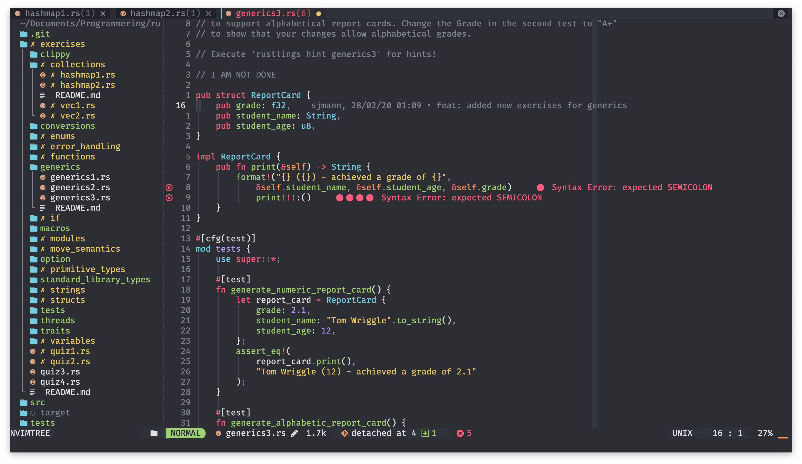
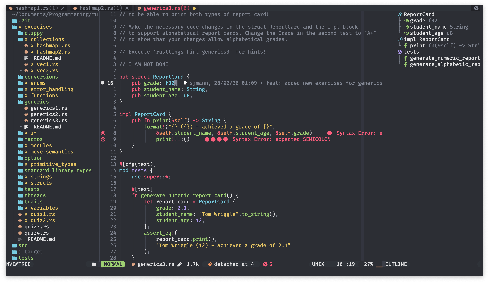
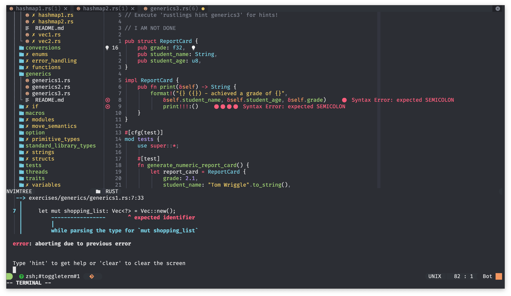

# Neovim dots

## Screenshots

## Plugin List

* Plugin manager: Packer
* Theme: Sonokai
* Nvim-web-Devicons
* Nvim-Tree
* Nvim-lspconfig
* Lspsaga.nvim
* Lspkind-nvim
* rust.vim
* rust-tools.vim
* nvim-treesitter
* nvim-bufferline
* galaxyline.nvim
* indent-blankline
* popup.nvim
* plenary.nvim
* telescope.nvim
* neoformat.nvim
* vim-commentary.nvim
* presence.nvim
* gitsigns.nvim
* blamer.nvim
* auto-pairs
* undotree
* nvim-colorizer.lua
* dashboard-nvim
* nvim-toggleterm.lua
* nvim-lspinstall
* lsp-trouble.nvim
* vim-vsnip
* vim-vsnip-integ
* symbols-outline
* lsp_signature
* which-key
